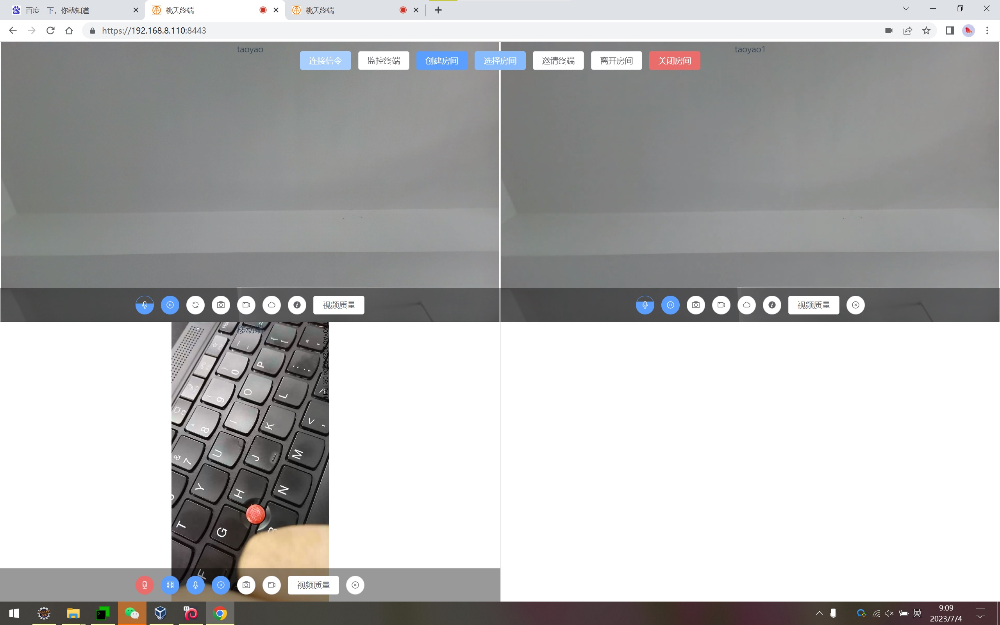
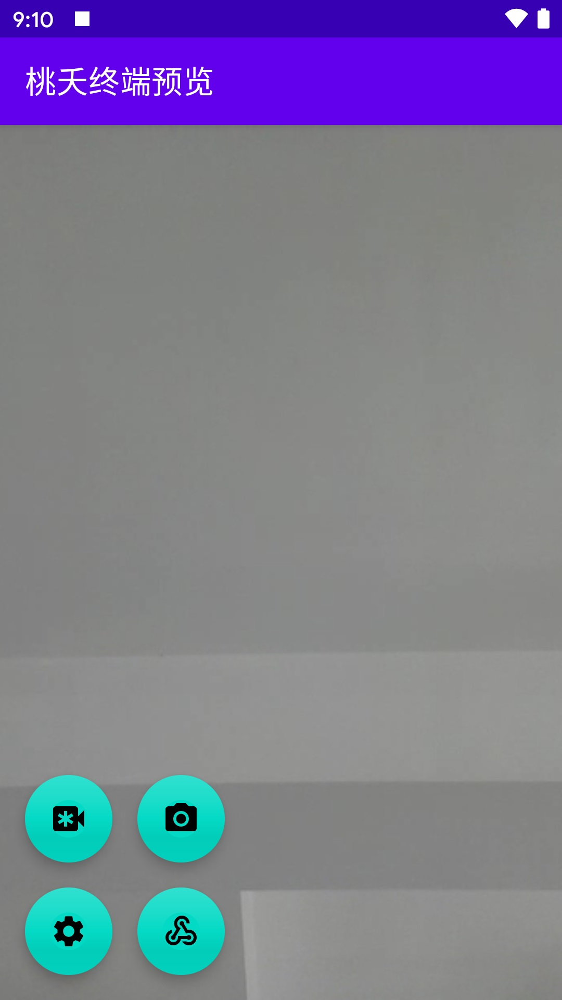

# 桃夭

桃夭是套基于`Mediasoup`开发的`WebRTC`音视频信令服务，可以非常方便的扩展信令接入更多智能终端。

<p align="center">
    
    <a target="_blank" href="https://starchart.cc/acgist/taoyao">
        
    </a>
    
    <br />
    
    
    
    
</p>

----

## 模块

|模块|名称|描述|
|:--|:--|:--|
|taoyao-client-web|H5终端|浏览器终端|
|taoyao-client-media|媒体终端|媒体服务|
|taoyao-client-android|安卓终端|安卓终端|
|taoyao-signal-server|信令服务|终端信令控制|

### Web终端功能

|功能|是否支持|是否实现|描述|
|:--|:--|:--|:--|
|P2P|支持|完成|视频会话（监控模式）|
|Mediasoup|支持|完成|视频房间（会议模式）|
|控制|支持|完成|完整控制信令|
|拍照|支持|完成|拍照|
|录像|支持|完成|录像|

## Media终端功能

|功能|是否支持|是否实现|描述|
|:--|:--|:--|:--|
|Mediasoup|支持|完成|视频房间（会议模式）|
|控制|支持|完成|部分控制信令|
|拍照|支持|完成|拍照|
|录像|支持|完成|录像|

### Android终端功能

|功能|是否支持|是否实现|描述|
|:--|:--|:--|:--|
|P2P|支持|完成|视频会话（监控模式）|
|Mediasoup|支持|完成|视频房间（会议模式）|
|控制|支持|完成|部分控制信令|
|拍照|支持|完成|拍照|
|录像|支持|完成|录像|
|混音|支持|完成|多路混音|
|水印|支持|完成|视频水印|

### 注意事项

* `Web`终端不支持同时进入多个视频房间，`Android`终端支持。
* `Media`终端只支持录像之后自动生成预览图片，不支持视频直接拍照。
* `Media`终端只支持视频房间（会议模式）录像，视频会话（监控模式）不支持。

## Docker

```
acgist/taoyao-client-web
acgist/taoyao-client-media
acgist/taoyao-signal-server
```

## 证书

本地开发测试安装`docs/certs`中的`ca.crt`证书到`受信任的根证书颁发机构`

## 部署

[部署文档](./docs/Deploy.md)

## 终端预览



